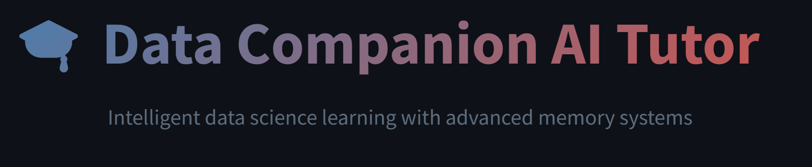

# Data Companion — RAG Tutor

Meet **Data Companion**, your intelligent RAG (Retrieval-Augmented Generation) tutor powered by advanced memory capabilities, personalized course recommendations, and **Pinecone**-powered ingestion. Built with **Streamlit**, **LangChain**, and **Google Gemini**/**Hugging Face** integration

[](https://github.com/Michael-Matta1/datacompanion-rag-tutor/releases)
[](https://www.python.org/downloads/)
[](https://github.com/Michael-Matta1/datacompanion-rag-tutor/blob/main/LICENSE)

## Demo

[](https://drive.google.com/file/d/1xumU6Y3bpa33xBwWzDdjzZR7gSBGOsxd/view)

## Table of Contents

- [Features](#features)
- [Architecture](#architecture)
- [Quick Start](#quick-start)
- [Configuration](#configuration)
- [Usage Examples](#usage-examples)
- [Technical Implementation](#technical-implementation)
- [User Interface](#user-interface)
- [Troubleshooting](#troubleshooting)
- [API Key Configuration Options](#api-key-configuration-options)

---

## Features

### Intelligent Memory System
- **Adaptive Memory**: Remembers user background, preferences, and learning progress across sessions
- **Contextual Understanding**: Connects concepts and maintains conversation context
- **Semantic Knowledge Extraction**: Intelligently extracts and stores user facts using embeddings
- **Memory-Driven Responses**: Tailors answers based on conversation history and user profile

### Advanced RAG Pipeline
- **Multi-Format Document Support**: PDF, DOCX, Markdown, and TXT files
- **Semantic Vector Search**: Pinecone-powered similarity search with optimized chunking
- **Context-Aware Retrieval**: Memory-integrated document retrieval for personalized responses
- **Format-Specific Processing**: Optimized text extraction and chunking strategies per file type

### Personalized Learning Experience
- **Course Recommendations**: Direct DataCamp course links with comprehensive metadata
- **Adaptive Difficulty**: Responses tailored to user experience level
- **Topic Tracking**: Intelligent tracking of user interests and learning progress
- **Learning Path Guidance**: Structured learning progression recommendations

### Flexible AI Backend
- **Primary**: Google Gemini API (gemini-1.5-flash) integration
- **Alternative**: Hugging Face Inference API (Mistral-7B-Instruct-v0.2) support
- **Easy Model Switching**: Simple configuration-based switching between providers
- **Robust Error Handling**: Graceful fallback mechanisms and comprehensive logging

## Architecture

```
datacompanion-rag-tutor/
├── .env                          # Environment variables
├── app.py                       # Main Streamlit application
├── ingestion.py                 # Data ingestion script
├── requirements.txt             # Python dependencies
├── README.md                    # Project documentation
├── LICENSE                      # MIT License
│
├── .streamlit/                  # Streamlit configuration
│   └── secrets.toml             # Alternative secrets configuration
│
├── data/                        # Course content files
│   └── (course materials - PDF, DOCX, MD, TXT)
│
├── metadata/                    # Course metadata
│   └── courses_info.csv         # Course information and links
│
├── src/                         # Core source code package
│   ├── __init__.py              # Package initialization
│   ├── config.py                # Configuration settings
│   ├── initialization.py        # System initialization functions
│   ├── llm_wrappers.py         # LLM wrapper classes
│   ├── memory_system.py        # Intelligent memory system
│   ├── rag_pipeline.py         # RAG processing pipeline
│   └── utils.py                 # Utility functions
│
└── venv/                        # Virtual environment
    └── (Python virtual environment files)
```

## Quick Start

### Prerequisites

- **Python**: Version 3.8 or higher
- **API Keys** (at least one required):
  - **Google Gemini API** (recommended)
  - **Hugging Face Inference API** (alternative)
- **Pinecone API**: For vector storage (required)

### Installation

1. **Clone the repository:**
   ```bash
   git clone https://github.com/Michael-Matta1/datacompanion-rag-tutor.git
   cd datacompanion-rag-tutor
   ```

2. **Create and activate virtual environment:**
   ```bash
   python -m venv venv
   
   # Windows
   venv\Scripts\activate
   
   # macOS/Linux
   source venv/bin/activate
   ```

3. **Install dependencies:**
   ```bash
   pip install -r requirements.txt
   ```

4. **Configure environment variables:**
   
   Create a `.env` file in the root directory (use `.env.example` as template):
   ```env
   # Primary Option: Google Gemini (Recommended)
   GOOGLE_API_KEY=your_google_api_key_here
   
   # Alternative Option: Hugging Face (uncomment if using)
   # HUGGINGFACE_API_KEY=your_huggingface_api_key_here
   
   # Vector Database (Required)
   PINECONE_API_KEY=your_pinecone_api_key_here
   PINECONE_INDEX_NAME=datacamp-courses-index
   ```

### Data Setup

#### Option 1: Use DataCamp-Downloader (Recommended)

Use the [forked datacamp-downloader](https://github.com/Michael-Matta1/datacamp-downloader) for automated content acquisition:

```bash
# Clone the downloader
git clone https://github.com/Michael-Matta1/datacamp-downloader.git
```

Follow the downloader's instructions to:
1. Download course materials and place them in the `data/` folder
2. Generate `courses_info.csv` using the `ddatacamp export-courses --output courses_info.csv` command and place it in the `metadata/` folder

#### Option 2: Manual Setup

1. **Course Content**: Place DataCamp course files in the `data/` directory
   - **Supported formats**: `.pdf`, `.docx`, `.md`, `.txt`
   - Files can contain course materials, exercises, and explanations

2. **Course Metadata**: Create `metadata/courses_info.csv` with the following structure:
   ```csv
   id,title,description,short_description,programming_language,difficulty_level,xp,time_needed_in_hours,topic_id,technology_id,content_area,link,image_url,last_updated_on,nb_of_subscriptions,num_chapters,num_exercises,num_videos,datasets_count,instructors_names,collaborators_names,tracks_titles,prerequisites_titles
   ```

### Initialize Vector Database

Process documents and populate Pinecone:

```bash
python ingestion.py
```

The ingestion pipeline will:
- Process all supported files in the `data/` directory
- Extract text and metadata with format-specific optimization
- Create intelligent chunks tailored to each file format
- Upload embeddings to Pinecone with comprehensive metadata
- Verify successful indexing with detailed progress reporting

### Launch Application

```bash
streamlit run app.py
```

Access the application at `http://localhost:8501`

## Configuration

### API Model Switching

The system supports both Google Gemini and Hugging Face APIs:

**Google Gemini (Default):**
- Ensure `GOOGLE_API_KEY` is set in `.env`
- Keep Google Gemini sections uncommented in `src/initialization.py` and `src/llm_wrappers.py`

**Hugging Face (Alternative):**
1. Set `HUGGINGFACE_API_KEY` in `.env`
2. In `src/initialization.py` (lines 41-64):
   - Comment out Google Gemini section
   - Uncomment Hugging Face section
3. In `src/llm_wrappers.py`:
   - Uncomment `HuggingFaceLLM` class and related imports
4. Update footer in `app.py` (line 88) to show "Hugging Face"

### Memory System Tuning

Adjust memory settings in `src/config.py`:

```python
class AppConfig:
    # Memory configuration
    CONVERSATION_WINDOW_SIZE = 12          # Conversation turns to remember
    MAX_USER_FACTS = 25                    # Maximum user facts to store
    FACT_SIMILARITY_THRESHOLD = 0.82       # Semantic similarity threshold
    FACT_RELEVANCE_THRESHOLD = 0.25        # Relevance threshold for retrieval
    
    # Retrieval settings
    SIMILARITY_SEARCH_K = 5                # Documents to retrieve
    
    # Generation settings
    LLM_TEMPERATURE = 0.2                  # Response creativity (0.0-1.0)
    LLM_MAX_OUTPUT_TOKENS = 600            # Maximum response length
```

### Vector Database Configuration

Configure Pinecone settings:

```python
# Embedding model configuration
EMBEDDINGS_MODEL = "sentence-transformers/all-MiniLM-L6-v2"  # 384 dimensions

# Index configuration (in ingestion.py)
pc.create_index(
    name="datacamp-courses-index",
    dimension=384,
    metric="cosine",
    spec=ServerlessSpec(cloud="aws", region="us-east-1")
)
```

## Usage Examples

### Learning Interactions

**Concept Explanations:**
- "Explain pandas DataFrames for beginners"
- "How do I handle missing data in Python?"
- "What's the difference between supervised and unsupervised learning?"

**Course Discovery:**
- "Give me a link about machine learning"
- "What courses should I take for Python data analysis?"
- "I want to learn data visualization"

**Personalized Learning:**
- "I'm new to programming but have statistics background"
- "Remember that I work with healthcare data"
- "What did we discuss about my Python skills last time?"

### Advanced Memory Features

The system maintains context across conversations:

```
Session 1:
User: "I'm a marketing analyst transitioning to data science"
Assistant: [Stores: user background, career transition goal]

Session 2:
User: "What should I learn next?"
Assistant: "Based on your marketing background and data science goals..."
```

### Intelligent Course Matching

The system analyzes queries for:
- **Topics**: Machine learning, data visualization, statistics
- **Difficulty level**: Beginner, intermediate, advanced
- **Programming language**: Python, R, SQL
- **Context**: User's stated experience and goals

## Technical Implementation

### Memory System Architecture

**Multi-layered Memory:**
1. **LangChain ConversationBufferWindowMemory**: Recent conversation context
2. **Semantic Fact Extraction**: LLM-powered structured information extraction
3. **Vector-based Similarity**: Embedding-based fact matching and retrieval
4. **Intent Classification**: Query categorization for context-aware responses

### RAG Pipeline Components

**Document Processing:**
- **PDF**: PyPDF2 with error recovery
- **DOCX**: python-docx with structured text extraction
- **Markdown**: markdown + BeautifulSoup for clean text
- **TXT**: Encoding-aware text processing

**Intelligent Chunking:**
- Format-specific chunk sizes and overlap settings
- Recursive character splitting with natural breakpoints
- Enhanced metadata for improved retrieval accuracy

**Enhanced Retrieval:**
- Memory-integrated query expansion
- Semantic similarity search with Pinecone
- Context-aware document ranking and filtering

### Data Ingestion Pipeline

**Robust Processing:**
- **Batch Processing**: Efficient handling of large document collections
- **Error Recovery**: Exponential backoff retry mechanisms
- **Progress Monitoring**: Comprehensive logging and status tracking
- **Format Detection**: Automatic file type identification
- **Metadata Enrichment**: Intelligent course information extraction

## User Interface

### Key Features

- **Modern Design**: Responsive interface with gradient styling
- **Real-time Status**: System health indicators for all components
- **Memory Dashboard**: Live memory system metrics and statistics
- **Source Citations**: Expandable course references with document previews
- **Chat Export**: Download conversation history in JSON format

### Customization Options

UI elements can be customized in `src/config.py`:

```python
# Styling configuration
CSS_TEMPLATE = """<style>
    .main-header { /* Custom header styles */ }
    .subtitle { /* Custom subtitle styles */ }
</style>"""

# Display mappings
LANGUAGE_EMOJIS = {
    'python': '🐍',
    'r': '📊',
    'sql': '🗃️',
    # Add custom mappings
}
```

## Troubleshooting

### Common Issues

**Vector Store Connection Failed:**
- Verify Pinecone API key and quota limits
- Ensure index name matches configuration
- Check index exists and is ready in Pinecone console

**LLM API Errors:**
- Confirm API key validity and remaining quota
- Verify network connectivity to API endpoints
- Check API service status on provider websites

**Memory System Issues:**
- Verify embeddings model download completed
- Check available disk space for model files
- Monitor memory usage during extended sessions

**Document Ingestion Problems:**
- Ensure files are in supported formats (PDF, DOCX, MD, TXT)
- Verify file permissions and encoding
- Check minimum content length requirement (>100 characters)

## API Key Configuration Options

**Configuration Methods:**
- Use `.env` file for local development
- Use `.streamlit/secrets.toml` for Streamlit Cloud deployment

## License

This project is licensed under the MIT License - see the [LICENSE](LICENSE) file for details.

## Acknowledgments

- **DataCamp** - Educational content and course structure inspiration
- **LangChain** - RAG pipeline framework and memory management
- **Pinecone** - Vector database infrastructure and semantic search
- **Google/Hugging Face** - AI model APIs and language understanding
- **Streamlit** - Web application framework and user interface

## Related Projects

This RAG tutor is part of a complete DataCamp learning analytics ecosystem:

- **[DataCamp Downloader](https://github.com/Michael-Matta1/datacamp-downloader)** - Download and export your course materials and metadata
- **[Course Metadata Dataset](https://www.kaggle.com/datasets/michaelmatta0/datacamp-courses-metadata/data)** - Comprehensive dataset for learning analytics  
- **[Learning Journey Visualization](https://www.kaggle.com/code/michaelmatta0/learning-journey-visualization/)** - Interactive analysis of learning patterns


## Additional Resources

- [DataCamp Course Downloader](https://github.com/Michael-Matta1/datacamp-downloader)
- [Pinecone Documentation](https://docs.pinecone.io/)
- [LangChain Documentation](https://python.langchain.com/)
- [Streamlit Documentation](https://docs.streamlit.io/)
- [Google Gemini API](https://ai.google.dev/)
- [Hugging Face Inference API](https://huggingface.co/docs/api-inference/)

---

**Note**: This project is for educational purposes. Please ensure compliance with DataCamp's terms of service when using their content for personal use.
